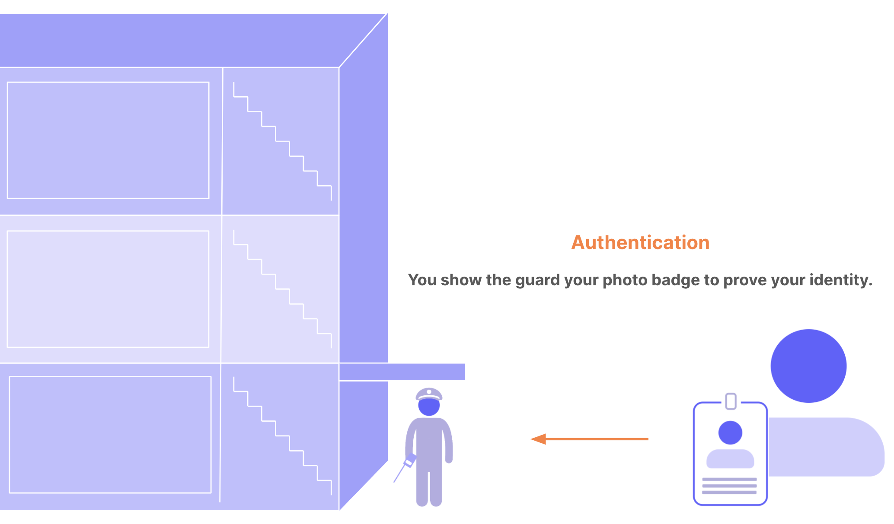
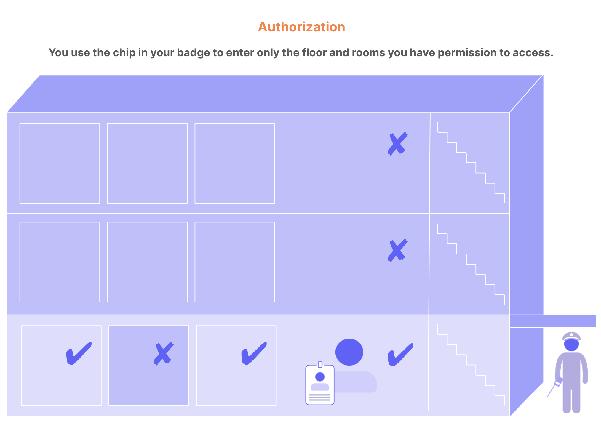

# Introduction to Identity and Access Management (IAM)

## What is IAM
Identity and Access Management (IAM) provides control over user, device validation and resource access. This technology ensures that:
- the right people (can have access to)
- the right resource
- at the right time
- for the right reasons

## IAM basic concepts
Fundamental concepts of IAM:
- **Digital resource**:\
    Is any combination of applications and data in a computer system. Examples of digital resources include web applications, APIs, platforms, devices, or databases.
- **Identity**:\
    The core of IAM is identity. Someone wants access to your resource. It could be a customer, employee, member, participant, and so on. In IAM, a user account is a `digital identity`. User accounts can also represent non-humans, such as software, Internet of Things devices, or robotics.
- **Authentication**:\
    Is the verification of a `digital identity`. Someone (or something) authenticates to prove that they’re the user they claim to be. 
- **Authorization**:\
    Is the process of determining what resources a user can access.

## The difference between authentication and authorization
It's common to confuse authentication with authorization. You can think of authentication and authorization as the security system for an office building. Users are the people who want to enter the building. Resources that people want to access are areas in the building: floors, rooms, and so on.

- **Authentication**:\
    When you enter the building, you must show your photo ID badge to the security guard. The guard compares the photo on the badge to your face. If they match, the guard lets you through the door to try to access different areas of the building. The guard doesn’t tell you what rooms you can access; they only get proof that you are who you claim to be. This is authentication: confirming user identity.
    

- **Authorization**:\
    In this scenario, imagine the elevators and doorways in the building have key sensors for access. The chip in your badge gives you access only to the first floor, which your company occupies. If you swipe your badge to enter any other floor, your access is denied. You can access your private office but not those belonging to your colleagues. You can enter the supply room but not the server room. This is authorization: granting and denying access to different resources based on identity.
    
## What does IAM do?
Identity and access management gives the control over user validation and resource access: 

- How users become a part of your system

- What user information to store

- How users can prove their identity

- When and how often users must prove their identity

- The experience of proving identity

- Who can and cannot access different resources

In real life, IAM is complex. Most systems require some combination of these capabilities:

- **Seamless sign up and login experiences**\
    Smooth and professional login and sign up experiences occur within your app, with your brand’s look and language. 

- **Multiple sources of user identities**\
    Users expect to be able to log in using a variety of social (such as Google or Linkedin), enterprise (such as Microsoft Active Directory), and other identity providers.

- **Multi-factor authentication (MFA)**\
    In an age when passwords are often stolen, requiring additional proof of identity is the new standard. Fingerprint authentication and one-time passwords are examples of common authentication methods. To learn more, read Multi-Factor Authentication (MFA).

- **Step-up authentication**\
    Access to advanced capabilities and sensitive information require stronger proof of identity than everyday tasks and data. Step-up authentication requires additional identity verification for selected areas and features. To learn more, read Add Step-up Authentication.

- **Attack protection**\
    Preventing bots and bad actors from breaking into your system is fundamental to cybersecurity. To learn more, read Attack Protection.

- **Role-based access control (RBAC)**\
    As the number of users grows, managing the access of each individual quickly becomes impractical. With RBAC, people who have the same role have the same access to resources.

## How does IAM work?

### Identity providers
In the past, for each new application you want to use, a corresponding new account created. By the time, the services that you registered become countless. Using `Identity Providers` helps to solve the enormous numbers of account problem. Some typical identity providers are:
- Google Account
- LinkedIn
- Microsoft Account
- Facebook Account
- ...

### Authentication factors
Authentication factors are methods for proving a user’s identity. They commonly fall into these basic types:
| Factor type   | Examples  |
|     ---       |    ---    |
| Knowledge (something you know)| Pin, Password|
| Possession (something you have)| Mobile phone, encryption key device|
|Inherence (something you are)| Fingerprint, facial recognition, iris scan|

IAM systems require one or many authentication factors to verify identity.

### Authentication and authorization standard

Authentication and authorization standards are open specifications and protocols that provide guidance on how to:
- Design IAM systems to manage identity
- Move personal data securely
- Decide who can access resources

These IAM industry standards are considered the most secure, reliable, and practical to implement:
- **OAuth 2.0**\
OAuth 2.0 is a delegation protocol for accessing APIs and is the industry-standard protocol for IAM. An open authorization protocol, OAuth 2.0 lets an app access resources hosted by other web apps on behalf of a user without ever sharing the user’s credentials. It’s the standard that allows third-party developers to rely on large social platforms like Facebook, Google, and Twitter for login. To learn more, read [OAuth 2.0 Authorization Framework](https://auth0.com/docs/authenticate/protocols/oauth).

- **Open ID Connect**\
A simple identity layer that sits on top of OAuth 2.0, OpenID Connect (OIDC) makes it easy to verify a user’s identity and obtain basic profile information from the identity provider. OIDC is another open standard protocol. To learn more, read [OpenID Connect Protocol](https://auth0.com/docs/authenticate/protocols/openid-connect-protocol).

- **JSON web tokens**\
JSON web tokens (JWTs) are an open standard that defines a compact and self-contained way for securely transmitting information between parties as a JSON object. JWTs can be verified and trusted because they’re digitally signed. They can be used to pass the identity of authenticated users between the identity provider and the service requesting the authentication. They also can be authenticated and encrypted. To learn more, read [JSON Web Tokens](https://auth0.com/docs/secure/tokens/json-web-tokens).

- **Security Assertion Markup Language (SAML)**\
Security Assertion Markup Language (SAML) is an open-standard, XML-based data format that lets businesses communicate user authentication and authorization information to partner companies and enterprise applications that their employees use. To learn more, read [SAML](https://auth0.com/docs/authenticate/protocols/saml).

- **Web Services Federation (WS-Fed)**\
Developed by Microsoft and used extensively in their applications, this standard defines the way security tokens can be transported between different entities to exchange identity and authorization information. To learn more, read [Web Services Federation Protocol](https://auth0.com/docs/authenticate/protocols/ws-fed-protocol).
---
References:\
[Introduction to Identity and Access Management (IAM) - Auth0](https://auth0.com/docs/get-started/identity-fundamentals/identity-and-access-management#the-difference-between-authentication-and-authorization)