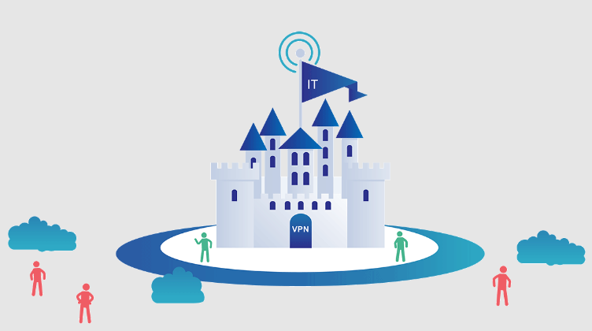
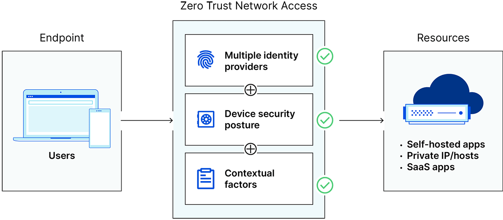

# 1. Zero-trust networks

## 1.1. What is the zero-trust security?
### **What?**
Zero Trust security is an IT security model that requires strict identity verification for every person and device trying to access resources on a private network, regardless of whether they are sitting within or outside of the **network perimeter**. This means that every access request must be authenticated and authorized before it is granted.

*Fact: Traditional IT network security trusts anyone and anything inside the network, while A Zero Trust architecture trusts no-one and nothing.*

### Why?

Traditional IT network security is based on the castle-and-moat concept. In castle-and-moat security, it is hard to obtain access from outside the network, but everyone inside the network is trusted by default. The problem with this approach is that once an attacker gains access to the network, they have free rein over everything inside. This vulnerability in castle-and-moat security systems is exacerbated by the fact that companies no longer have their data in just one place. Today, information is often spread across cloud vendors, which makes it more difficult to have a single security control for an entire network. Hence, Zero-trust Security get involved.

### Zero Trust Network Access (ZTNA)
Zero Trust Network Access (ZTNA) is the technology that makes it possible to implement a Zero Trust security model. "Zero Trust" is an IT security model that assumes threats are present both inside and outside a network. Consequently, Zero Trust requires strict verification for every user and every device before authorizing them to access internal resources. In ZTNA, connected devices are not aware of any resources (applications, servers, etc.) on the network other than what they are connected to.

***References:***\
*[Zero Trust security - Cloudflare](https://www.cloudflare.com/learning/security/glossary/what-is-zero-trust/)*

## 1.2. The zero-trust system architectures

**Main principles behind Zero Trust:**
- **Continuous monitoring and validation**\
    The philosophy behind a Zero Trust network assumes that there are attackers both within and outside of the network, so no users or machines should be automatically trusted. Zero Trust verifies user identity and privileges as well as device identity and security. Logins and connections time out periodically once established, forcing users and devices to be continuously re-verified.

- **Least priviledge**\
    Users and devices should only be granted the minimum privileges they need to perform their tasks.

- **Device access control**\
    In addition to controls on user access, Zero Trust also requires strict controls on device access. Zero Trust systems need to monitor how many different devices are trying to access their network, ensure that every device is authorized, and assess all devices to make sure they have not been compromised. This further minimizes the attack surface of the network.

- **Microsegmentation**\
    Zero Trust networks also utilize microsegmentation. Microsegmentation is the practice of breaking up security perimeters into small zones to maintain separate access for separate parts of the network. For example, a network with files living in a single data center that utilizes microsegmentation may contain dozens of separate, secure zones. A person or program with access to one of those zones will not be able to access any of the other zones without separate authorization.

- **Preventing lateral movement**\
    In network security, "lateral movement" is when an attacker moves within a network after gaining access to that network. Lateral movement can be difficult to detect even if the attacker's entry point is discovered, because the attacker will have gone on to compromise other parts of the network.

    Zero Trust is designed to contain attackers so that they cannot move laterally. Because Zero Trust access is segmented and has to be re-established periodically, an attacker cannot move across to other microsegments within the network. Once the attacker's presence is detected, the compromised device or user account can be quarantined, cut off from further access. (In a castle-and-moat model, if lateral movement is possible for the attacker, quarantining the original compromised device or user has little to no effect, since the attacker will already have reached other parts of the network.)

- **Multi-factor authentication (MFA)**\
    Multi-factor authentication (MFA) is also a core value of Zero Trust security. MFA means requiring more than one piece of evidence to authenticate a user; just entering a password is not enough to gain access. A commonly seen application of MFA is the 2-factor authorization (2FA) used on online platforms like Facebook and Google. In addition to entering a password, users who enable 2FA for these services must also enter a code sent to another device, such as a mobile phone, thus providing two pieces of evidence that they are who they claim to be.

***References:***\
*[Zero Trust security - Cloudflare](https://www.cloudflare.com/learning/security/glossary/what-is-zero-trust/)*

## 1.3. [Challenges in implementing Zero Trust](https://www.forbes.com/sites/forbestechcouncil/2023/04/11/the-top-five-challenges-of-zero-trust-security/?sh=4e7b622d4e25)
- **Erosion Of Traditional Control Points**\
    Zero-trust security follows a "never trust, always verify" principle, which means that every user and device must be authenticated before accessing a resource or data. This principle is dependent on a key assumption that the company controls the endpoint, network connection, or resource the user is trying to access. However, the reality is that more employees are working remotely and using SaaS services, and a company’s data and critical applications are increasingly beyond the enterprise's perimeter. The result is that in many cases, the traditional control points are no longer effective.

- **Growth Of Business-Led IT, a.k.a. Shadow SaaS**\
    Shadow IT has now become shadow SaaS, and it is no longer considered a negative and is often now referred to as business-led IT. No company provides their employees with every app needed, so employees go out and acquire the apps they need on their own. The challenge is that most of these apps do not go through an official purchasing process and are used outside of the governance of security. The main benefit of business-led IT is the ease and speed of accessing the app. Integrating into a zero-trust security framework would require weeks or months, which negates productivity and enterprise agility benefits.

- **Digital Supply Chain Vulnerability**\
    Digital products are increasingly relying on SaaS services as key building blocks. This creates a network of systems that are connected through various networks and interfaces that can be extremely complex and requires a high level of trust. However, in a digital supply chain, it may not always be feasible to authenticate and authorize every entity involved in the supply chain due to a large number of participants and the dynamic nature of the interactions. For example, a manufacturer may have to rely on a third-party supplier for certain components, and this supplier may have its own set of suppliers and partners. Since zero trust relies on users, the risks of a digital supply chain are not covered.

- **Integrating Security Silos**\
    Modern cybersecurity is extremely complex, and companies are constantly adding new products to address new threats. This has created an environment where most security products operate in silos, where different teams or departments within an organization are responsible for their own security, and they may not share information or collaborate with other teams. This can create blind spots and gaps in security, as well as lead to inconsistencies in policies and procedures that create barriers to implementing zero-trust security. For the framework to be effective, it requires a holistic view of security, where all parts of the organization work together to create a unified security architecture.

- **Single Source Of Truth For Risk**\
    Understanding risk is critical to zero-trust security, and not having a single source of truth for risk can be a challenge because it can lead to inconsistencies and conflicts in risk assessments across different systems and departments. Today, risk is assessed from multiple viewpoints such as endpoint, network, user, application, etc., and there is no single source of truth. This can lead to conflicting risk assessments and result in users being granted access to resources they should not have access to or be denied access to resources they should have access to.

***References:***\
*[The Top Five Challenges Of Zero-Trust Security - Forbes](https://www.forbes.com/sites/forbestechcouncil/2023/04/11/the-top-five-challenges-of-zero-trust-security/?sh=4e7b622d4e25)*