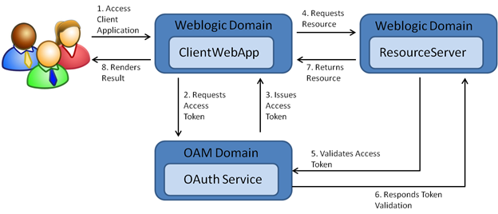
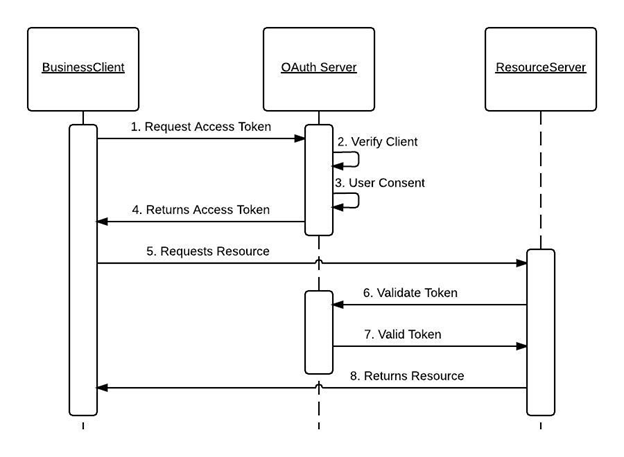
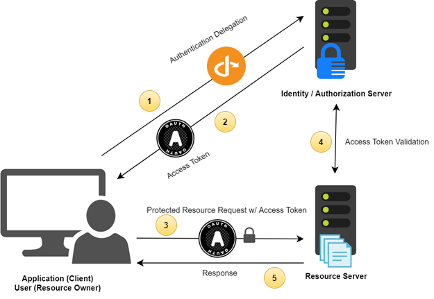

# OAuth 2.0 - (Open Authorization 2.0)

## What is OAuth 2.0?
OAuth 2.0 (stands for **Open Authorization**) is a version 2.0 of industry-standard authorization protocol that allows third-party applications access user's protected resources without exposing user's credentials to those third-party services.

## Architecture and use case flow

### Architecture

### Use case flow

<!-- **Terminologies**
- Resource server - The server hosting the protected resources
- OAuth server - The server issuing access token
- Client - Third-party applications, services, etc. -->

# OIDC (OpenID Connect)

## What is OIDC?
OIDC (stands for OpenID Connect) is a authorization protocol that built on [OAuth 2.0](#oauth-20---open-authorization-20) protocol. It is an identity layer on top of OAuth. While OAuth touches authorization only, OIDC allows user's information to be used without revealing user's credentials.

## Architecture

## Key differences between OIDC and OAuth 2.0
| OIDC  | OAuth 2.0 |
| ---   | ---       |
| Includes user authentication and identity token issuance | Does not include user authentication or identity token issuance |
| More complexity | Less complexity |

## Use cases
Some real-world use cases:
- Sign in with Google, Facebook, LinkedIn
- etc

<!-- # OAuth 2.0 vs OIDC -->