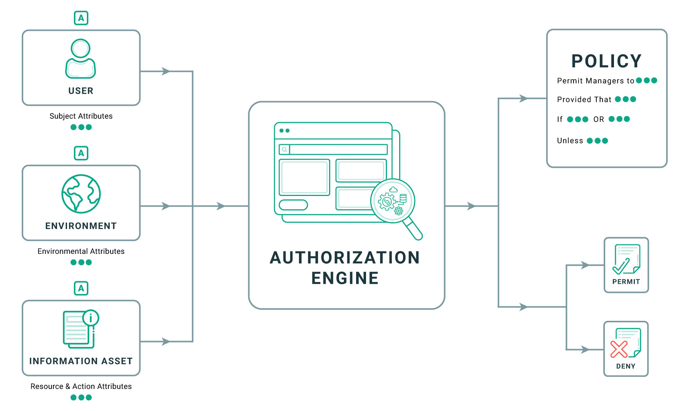

# Authorization Model

## What is authorization model and why we need it?
When operating a large IT system with numerous services, managing the access of users is an important mission. To solve this problem people use **authorization model**. An **authorization model** has policies; and all users must obey that. The authorization model controls which users have access to protected resources and which resources are available to authorized users.

## Popular authorization models: RBAC and ABAC

### RBAC (Role-based Access Control)
Authorization model defines a list of roles. Each role is associated with specific resources. Which resources that users can access depend on their role.

### ABAC (Attribute-based Access Control)
Attribute-based access control (ABAC) is an authorization strategy that defines permissions based on attributes.
ABAC is a more flexible authorization model that allows permissions to be assigned based on a wider range of attributes, such as user identity, resource type, and time of day.

## RBAC vs. ABAC

### RBAC
**Characteristics**
- Rules definition in RBAC is simple and takes less processing time and resources.
- Access hierarchies that align with your organizational structure can be created.
- RBAC suffers from a role explosion (adding a lot of roles to add granularity). If you can avoid this, then it is a low-cost implementation.

**When to Use RBAC**
- RBAC is ideal for a small-to-medium-sized organization.
- It also works well with organizations that have well-defined groups.
- RBAC is a good choice if you have limited time and resources or are running on a limited budget.

### ABAC
**Characteristics**
- ABAC provides fine-grained access control and a targeted approach to security.
- You can easily add or revoke access for resources, entities, and members.
- ABAC is hard to implement, though highly flexible, and is time-consuming and resource-intensive.

**When to Use ABAC**
- ABAC is ideal when you have ample time, resources, and budget.
- It also works well with organizations that have a team distributed across geographies.
- You also need authorization models to define rules based on location or time zone.

---
References:
- [Designing an Authorization Model for an Enterprise - Cerbos](https://cerbos.dev/blog/designing-an-authorization-model-for-an-enterprise)
- [Authorization models - PEGA Academy](https://academy.pega.com/topic/authorization-models/v1)