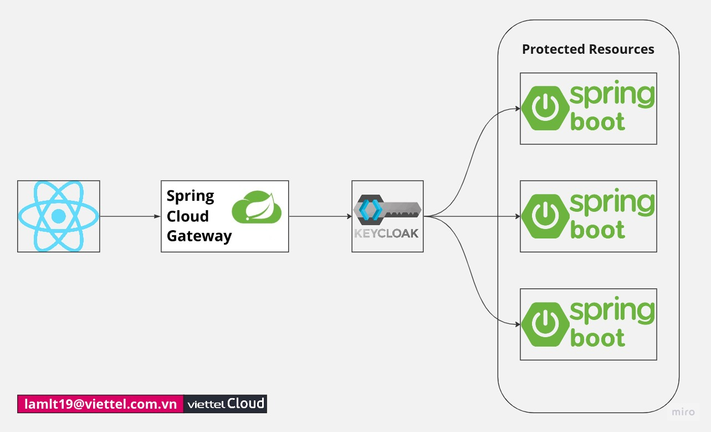

# Knowledge gained this week
## **Spring Boot framework**
This is the first time I use Spring Boot for creating web applications. It's very time-consuming to understand the project structure, building tools (maven, gradle), dependencies, properties, the flow of code; even though I've learned Java before (at very basic level).

## **Quarkus**
Traditional Java stacks has well supported monolithic applications. However, in the world where cloud, Kubernetes and container are at every corner, traditional Java stacks runs not really efficiently. It requires long startup times and large memory. Thus, Quarkus was created.

Some features:
- Live coding - immediately check the effect of code changes
- Support for Graal/SubstrateVM
- Built around a container-first philosophy, meaning it’s optimized for lower memory usage and faster startup times
- Effective solution for running Java in serverless architecture, microservices, containers, Kubernetes, function-as-a-service (FaaS)

## **Keycloak**
- Understand key concepts, such as Realm, Clients, Roles, Users, etc.
- Be able to configure Keycloak as an **AuthN-AuthZ Server**
- Integrate Spring Boot applications (backend) with Keycloak

## **Tutorial: Secure APIs using Quarkus and Keycloak**
*Reference: [Securing Cloud Native Microservices with Role-Based Access Control using Keycloak - CNCF](https://www.cncf.io/blog/2023/05/17/securing-cloud-native-microservices-with-role-based-access-control-using-keycloak/)*

Following the tutorial above, I'm able to secure Spring Boot APIs using Keycloak, understand how to use Quarkus.

Conclusions after using Quarkus:
- Live coding - just change the code, Quarkus will automatically apply all these changes immediately.
- Easily integrate Keycloak with one command:
```bash
quarkus ext add odic samllrye-openapi
```

# Integrate Spring Boot, React with Keycloak
*Reference: [How to SECURE My Microservices Architecture (REACTJS + SPRING CLOUD GATEWAY) With Keycloak - The Dev World - by Sergio Lema](https://youtu.be/hfeOqvHxHO8)*
## System architecture

*(I think this picture doesn't describe accurately how the services interact with each other)*
## Sequence diagram
updating...
## Project structure
```
├── backend-gateway-client
│   ├── pom.xml
│   ├── src
│   └── target
├── backend-keycloak-auth
│   └── docker-compose.yml
├── backend-resources
│   ├── pom.xml
│   ├── src
│   └── target
├── frontend-react
│   ├── node_modules
│   ├── package.json
│   ├── package-lock.json
│   ├── public
│   ├── src
│   └── yarn.lock
└── pom.xml
```
---
At this time, I have some small bugs with React frontend to connect with Keycloak. I'm trying to fix it!